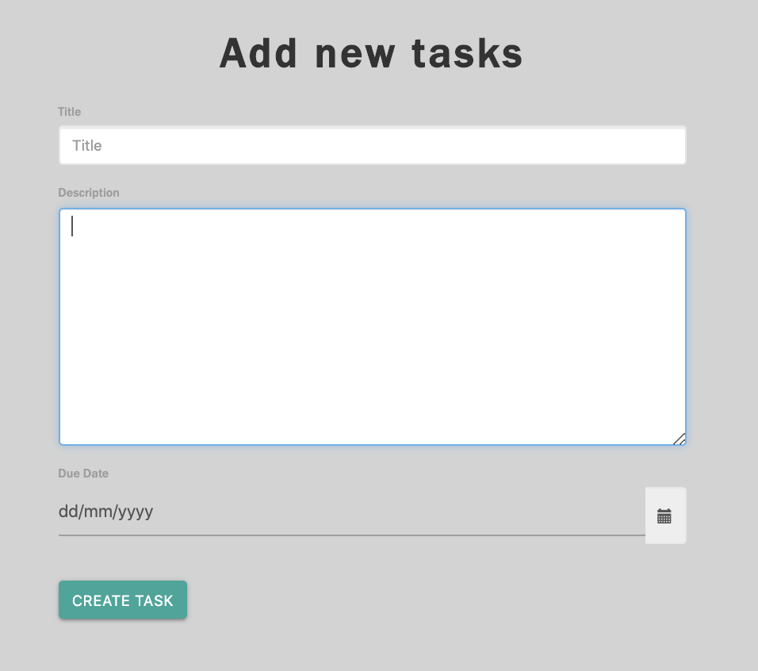

# TASK MASTER PRO

Task Master Pro is an application which is  allows groups of users to work together more cohesively to quickly and thoroughly complete assigned tasks. Features such as time tracking and project tracking ensure that all given tasks are covered and progress reports are up to date. Task Master Pro is mobile-first application and including other functions such google maps and address retrival, email syncing, collaborative interfaces for all users. Task Master Pro application is related to Project Management software, Time Management software, Professional Services Automation software.

## Motivation

The motivation behind this project is a real-world issue faced by one of the project team member in his workplace. There is a real need for assign tasks to clients and track their progress, but the organization does not want to use any off the shelf product due to privacy issues. As a team, we decided to do a  project that can create and assign tasks and track their progress. It also includes authentication and authorization. 

## User Stories
- As an admin I want to create clients.
- As an admin, I want to create and assign tasks to clients
- As an admin, I want to monitor the progress of tasks
- As a client, I want to update progress of tasks.
- As a client, I want to monitor the progress of the tasks.


## Functionalities

- Create Users
- Create Tasks
- Create Clients
- View Users and Clients
- Assign Tasks
- Start and Complete Tasks

## Technologies Used 
- HTML
- CSS
- JavaScript
- Node
- Express
- MySQL
- sequelize ORM
- Express-handlebars
- Passport and passport-local for authentication

## Links

[Heroku Repository](https://taskmasterpro.herokuapp.com)

[GIT Repository](https://github.com/anu-dam/TMC)

### Login Page


### Home Page


### Task Assign Page



## Getting Started

To get a copy, fork the repository.

### Prerequisites

It needs node to run the application.

### Installing

After forking the repository, clone repository to local machine.

Run the following command in the root directory to install the dependencies (it will install both root directory and inside client folder).

```
npm install
```

And run following command in the root directory, the application will open in default browser.

```
npm start
```

## Deployment

Follow Heroku CLI (or specific to the deployment platform) standard deployment method to deploy the application.

## Versioning

We use [Git](https://git-scm.com/) for versioning.

## Built With

- [React](https://reactjs.org/) - The web framework used
- [npm](https://www.npmjs.com/) - Dependency Management

<h4>Authors</h4>


[Jameskutty Sebastian](https://github.com/JameskuttySebastian)

[Chandu Koritala](https://github.com/ChanduKoritala)

[Anu Dambaladeniya](https://github.com/anu-dam)

## License

This project is licensed under the MIT License - see the [LICENSE.md](LICENSE.md) file for details

## Default Login

User id : admin@mail.com
Password: 1

## Acknowledgments

